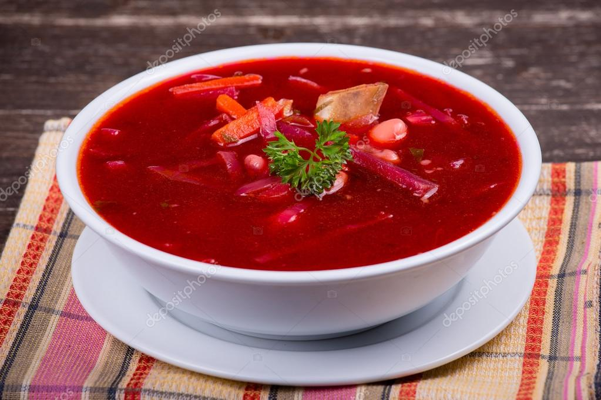

# Classic Borscht soup recipe for Fall
## Classic beef borscht recipe that you’ll come back to over and over again. *Simple ingredients, classic method and authentic taste! You don’t want to pass on this soup.* Perfect for dinner [I am a link!.](https://www.pinterest.de/pin/586664288977414988/)

***15 ingredients***
*Meat*

    1 lb Beef

**Produce**

    1 Bay leaf
    2 Beets, medium
    1/4 Cabbage (2-3 cups
    2 Carrots, medium
    2 Celery
    2 Garlic cloves
    1/2 Lemon, Juice of
    1/4 cup Parsley or dill
    2 Potatoes, medium
    1 Yellow onion, medium

**Canned Goods**

    4 tbsp Tomato paste

**Baking & Spices**

    2 tsp Kosher salt, coarse

**Oils & Vinegars**

    1 tbsp Olive oil

**Bread & Baked Goods**

    1 Sour cream and bread

